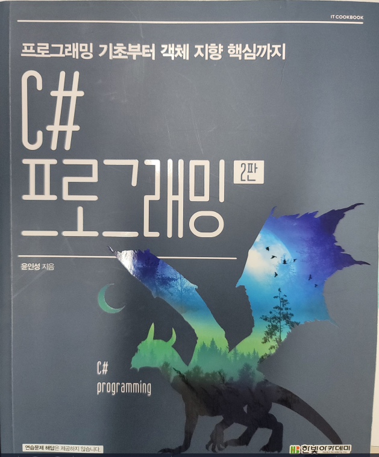

# CSStudy

> C# Study는 Visual Studio 2019버전으로 K-Digital Trainging 과정 중 학습한 내용을 정리하였습니다.
  **기간** : 2022년 7월 12일 ~ 2022년 8월 11일
  **학습 언어**    : C#

:bulb:   Git-구성
------------------------
* 교재 Chapter의 연습문제 풀이, 주간 테스트 EXAM 풀이, BackJUN, Programers 문제 풀이와 Project 폴더로 구성되어 있습니다. 
  * Toy Project로 WinForm으로 제작한 계산기, 데이터관리프로그램, 오목, 벽돌부수기, 테트리스를 제작하였습니다.

* 계산기
  * WinForm을 활용하여 제작한 Toy Project입니다.
  * 버튼 이벤트를 활용하여 간단한 계산을 구현하였습니다.

* 데이터관리프로그램
  * WinForm과 MYSQL을 연동하여 작성하였습니다.

* 오목
  * WinForm으로 오목 판과 돌을 구현하였고, 승리 조건에 해당하는 로직을 C# Visual Studio로 작성하였습니다.

* 벽돌부수기
  * Winform을 활용하여 벽돌, 볼, 판을 구현하였고 Time 이벤트와 충돌효과를 이용하여 벽돌 부수기를 구현하였습니다.

* 테트리스
  * MyTetris 폴더에서 작업 내용을 확인할 수 있습니다.
  * 콘솔창을 이용해서 테트리스 게임을 제작해보았습니다.
  * ASD키를 이용하여 블럭을 움직일 수 있습니다.

💾 김동훈 Git 작업 내역
------------------------
> 프로그래밍 기초부터 객체 지향 핵심까지 C# 프로그래밍 2판 교재의 Ch01부터 Ch11까지의 예제풀이로 구성되어 있습니다.

:nail_care: README.md Version ManageMent
------------------------

색인|버전|날짜|월|일|작업 내용
---|---|---|---|---|---|
1|V1.0|2022년|12월|27일|최초 README.md Commit
