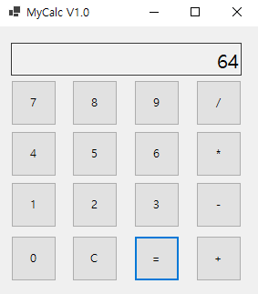
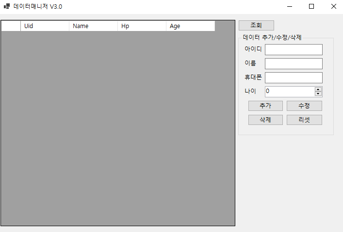
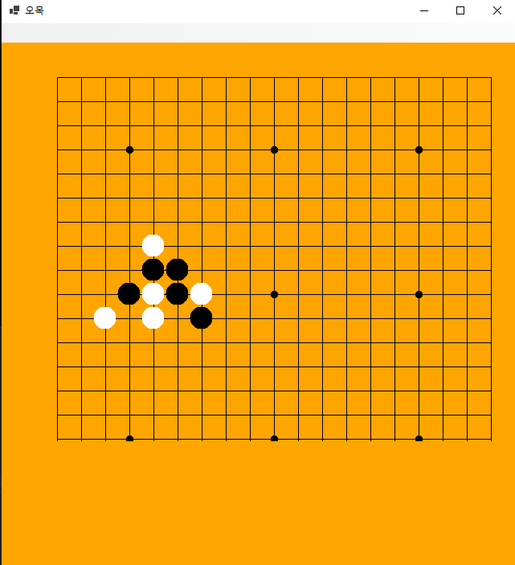
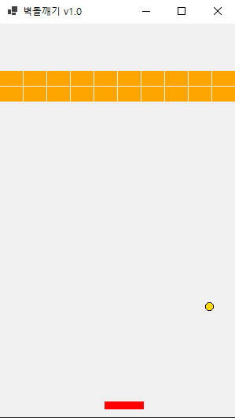
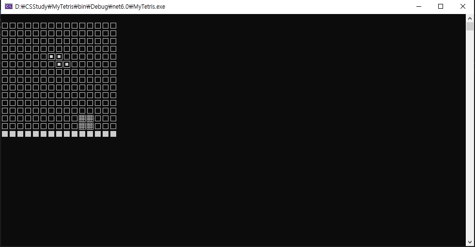

# CSStudy

> C# Study는 Visual Studio 2019버전으로 K-Digital Trainging 과정 중 학습한 내용을 정리하였습니다.
  **기간** : 2022년 7월 12일 ~ 2022년 8월 11일
  **학습 언어**    : C#

:bulb:   Git-구성
------------------------
* 교재 Chapter의 연습문제 풀이, 주간 테스트 EXAM 풀이, BackJUN, Programers 문제 풀이와 Project 폴더로 구성되어 있습니다. 
  * Toy Project로 WinForm으로 제작한 계산기, 데이터관리프로그램, 오목, 벽돌부수기, 테트리스를 제작하였습니다.

계산기

데이터관리프로그램

오목

벽돌부수기

테트리스

💾 김동훈 Git 작업 내역
------------------------
>> 교재명 " "의 Ch01부터 Ch11까지의 예제풀이로 구성되어 있습니다.
* 계산기
  * Player 폴더에서 이동, 아이템 상호작용, 스테이터스 변경, 플레이어의 Photon PUNRPC를 작업한 내용을 확인할 수 있습니다.
* 데이터관리프로그램
  * ParkourSystem 폴더에서 Player의 Parkour 기능을 구현한 작업 내용을 확인할 수 있습니다.
* 오목
  * Weapon 폴더에서 Player의 무기 착용, 무기 공격, 애니메이션 로직, 무기의 정보 Class 등의 작업 내용을 확인할 수 있습니다.  
* 벽돌부수기
  * DoorAndKey 폴더에서 문을 열고 닫는 로직을 작업한 내용을 확인할 수 있습니다.
* 테트리스
  * Breakable 폴더에서 파괴 Effect를 구현하기 위해 작업한 내용을 확인할 수 있습니다.
  * ScriptableOBJ 폴더에 Parkour와 Item을 Scriptable Asset으로 저장하였습니다.

이름|영어|정보|수학
---|---|---|---|
나동빈|98점|87점|72점
